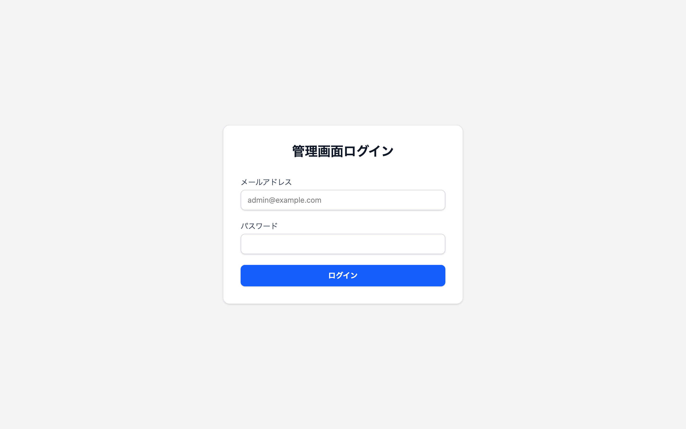
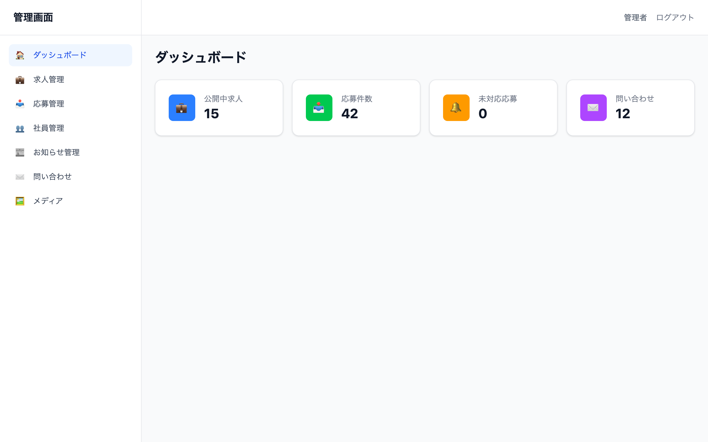
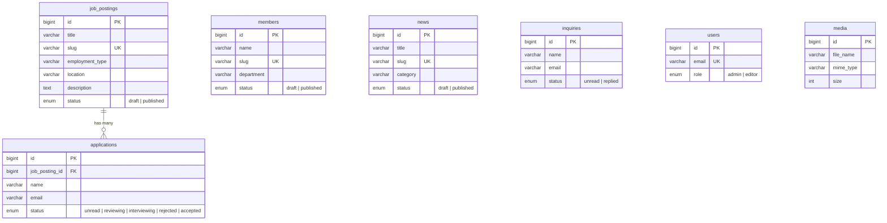

# 採用広報サイト + 応募管理ダッシュボード

[](https://github.com/yohei0819/modern-corporate-site/actions/workflows/ci.yml)

架空の企業「モダンコーポレート」の**採用広報サイト（公開面）**と**応募管理ダッシュボード（管理面）**を、フロントエンド 2 種 + バックエンド API の 3 層構成で開発したポートフォリオ作品です。

## 🌐 ライブデモ

| サービス | URL |
|----------|-----|
| 公開サイト (Next.js) | https://frontend-yohei0819.vercel.app |
| 管理画面 (Vue 3) | https://yohei0819.github.io/modern-corporate-site/ |
| API サーバー (Laravel) | https://recruit-api-sop3.onrender.com |

> ⚠️ Render 無料プランのため、API サーバーは無アクセスが続くとスリープします。初回アクセス時に 30 秒ほどかかる場合があります。

---

## � スクリーンショット


### 管理画面

| ログイン | ダッシュボード |
|:---:|:---:|
|  |  |

---

## �🔗 サービス構成

```
┌──────────────────┐     ┌──────────────────┐
│  公開サイト        │     │  管理画面          │
│  Next.js 15       │     │  Vue 3 + Vite     │
│  App Router / SSR │     │  SPA / Pinia      │
│  :3000            │     │  :5173            │
└────────┬─────────┘     └────────┬─────────┘
         │ Axios                   │ Axios
         └────────┐   ┌───────────┘
                  ▼   ▼
          ┌──────────────────┐
          │  Laravel 11 API   │
          │  Sanctum 認証     │
          │  :8000            │
          └────────┬─────────┘
                   │ Eloquent
                   ▼
          ┌──────────────────┐
          │  MySQL 8          │
          │  7 テーブル        │
          └──────────────────┘
```

---

## 📊 プロジェクト規模

| 項目 | 数値 |
|------|------|
| API エンドポイント | 39 |
| DB テーブル | 7 |
| Feature テスト | 85（179 アサーション） |
| フロントエンド単体テスト | 54（Vitest） |
| E2E テスト | 42（Playwright） |
| Swagger ドキュメント | 34 オペレーション |
| 公開サイト ページ | 12 |
| 管理画面 ビュー | 16 |

---

## 🛠️ 技術スタック

| レイヤー | 技術 | バージョン |
|----------|------|------------|
| 公開サイト | Next.js (App Router) / TypeScript / Tailwind CSS | 15.x / 4.x |
| 管理画面 | Vue 3 + Vite / Pinia / Vue Router / TypeScript / Tailwind CSS | 3.5.x / 4.x |
| API サーバー | Laravel / Sanctum / PHP | 11.x / 8.3 |
| DB | MySQL | 8.x |
| HTTP | Axios | 1.x |
| テスト | PHPUnit | 12.x |
| E2E テスト | Playwright | 1.x |
| コンテナ | Docker Compose | - |
| CI | GitHub Actions | - |
| デプロイ | Vercel (frontend) + Render (backend) | - |

### なぜフロントを 2 つに分けたか

| 観点 | 公開サイト（Next.js） | 管理画面（Vue 3） |
|------|----------------------|-------------------|
| レンダリング | SSR / SSG — SEO 重視 | CSR (SPA) — SEO 不要 |
| ルーティング | ファイルベース App Router | Vue Router + ナビゲーションガード |
| 向いている UI | ランディング・記事・一覧 | フォーム・テーブル中心の CRUD |

> Laravel はビューを持たず **JSON API に専念**し、関心を分離しています。

---

## 📁 ディレクトリ構成

```
モダンコーポレートサイト/
├── docs/                        # 設計ドキュメント
│   ├── sitemap.md               #   サイトマップ
│   ├── screen-list.md           #   画面一覧
│   ├── api-spec.md              #   API 仕様書（39 エンドポイント）
│   ├── db-design.md             #   DB 設計書（7 テーブル）
│   ├── er-diagram.md            #   ER 図（Mermaid）
│   ├── tech-stack.md            #   技術選定理由
│   └── phase-plan.md            #   開発フェーズ計画
│
├── frontend/                    # 公開サイト — Next.js 15 (App Router)
│   └── src/
│       ├── app/                 #   ルーティング（12 ページ）
│       │   ├── page.tsx         #     トップページ
│       │   ├── about/           #     会社紹介
│       │   ├── business/        #     事業紹介
│       │   ├── culture/         #     働く環境
│       │   ├── jobs/            #     求人一覧・詳細
│       │   ├── members/         #     社員紹介一覧・詳細
│       │   ├── news/            #     お知らせ一覧・詳細
│       │   ├── faq/             #     FAQ
│       │   ├── entry/           #     応募フォーム
│       │   ├── contact/         #     問い合わせフォーム
│       │   └── privacy/         #     プライバシーポリシー
│       ├── components/          #   共通コンポーネント
│       ├── lib/                 #   API クライアント・ユーティリティ
│       └── types/               #   TypeScript 型定義
│
├── admin/                       # 管理画面 — Vue 3 + Vite (SPA)
│   └── src/
│       ├── views/               #   画面（16 ビュー）
│       │   ├── DashboardView    #     ダッシュボード
│       │   ├── LoginView        #     ログイン
│       │   ├── jobs/            #     求人 CRUD
│       │   ├── applications/    #     応募管理
│       │   ├── members/         #     社員 CRUD
│       │   ├── news/            #     お知らせ CRUD
│       │   ├── inquiries/       #     問い合わせ管理
│       │   └── media/           #     メディア管理
│       ├── components/          #   UI / フォーム / テーブルコンポーネント
│       ├── stores/              #   Pinia ストア（認証・各リソース）
│       ├── services/            #   API サービス層
│       ├── router/              #   Vue Router（認証ガード付き）
│       └── types/               #   TypeScript 型定義
│
└── backend/                     # API サーバー — Laravel 11
    ├── app/
    │   ├── Http/Controllers/Api/ #  API コントローラ（7 個）
    │   ├── Http/Requests/       #   FormRequest バリデーション（5 個）
    │   ├── Models/              #   Eloquent モデル（7 個）
    │   └── Mail/                #   メール通知（3 個）
    ├── database/
    │   ├── migrations/          #   マイグレーション（7 テーブル）
    │   ├── factories/           #   テスト用ファクトリ（7 個）
    │   └── seeders/             #   初期データ
    ├── routes/api.php           #   API ルート定義
    └── tests/Feature/           #   Feature テスト（8 ファイル / 85 テスト）
```

---

## 🗄️ ER 図



> 詳細は [docs/er-diagram.md](docs/er-diagram.md) / [docs/db-design.md](docs/db-design.md) を参照

---

## ✨ 主要機能

### 公開サイト

| 機能 | 説明 |
|------|------|
| 会社紹介 / 事業紹介 / 働く環境 | 静的コンテンツページ |
| 求人一覧・詳細 | 雇用形態フィルタ / slug ベース URL |
| 社員紹介一覧・詳細 | プロフィール + インタビュー |
| お知らせ一覧・詳細 | カテゴリフィルタ / 公開日順 |
| FAQ | カテゴリ別 / アコーディオン / キーワード検索 |
| 応募フォーム | 入力 → 確認 → 完了の 3 ステップ / ファイルアップロード / 自動メール送信 |
| 問い合わせフォーム | バリデーション付き / 受付メール自動送信 |

### 管理画面

| 機能 | 説明 |
|------|------|
| ダッシュボード | 応募数・問い合わせ数の集計表示 / スケルトンローディング |
| 求人 CRUD | 作成・編集・削除 / 下書き↔公開切替 / slug 自動生成 |
| 応募管理 | ステータス管理（5 段階）/ 管理者メモ / CSV エクスポート |
| 社員 CRUD | プロフィール画像 / 表示順管理 |
| お知らせ CRUD | カテゴリ / 公開日 / リッチテキスト |
| 問い合わせ管理 | 未読→対応済みフロー / フィルタ |
| メディア管理 | 画像アップロード / URL コピー / MIME / サイズ検証 |
| 認証 | Sanctum トークン認証 / ルートガード |

### UI / UX

- **スクロールアニメーション** — FadeIn コンポーネントによる交差オブザーバ制御
- **スケルトンローディング** — データ取得中のプレースホルダ表示
- **エラー画面** — error.tsx / global-error.tsx / not-found.tsx
- **空状態コンポーネント** — 検索結果ゼロ時の案内 UI
- **アクセシビリティ** — スキップリンク / aria 属性 / focus-visible / prefers-reduced-motion
- **レスポンシブ** — モバイルハンバーガーメニュー（スクロールロック付き）
- **トースト通知** — 管理画面の操作フィードバック

---

## 🧪 テスト

PHPUnit 12 による Laravel Feature テスト — **85 テスト / 179 アサーション 全パス**

| テストファイル | テスト数 | カバー範囲 |
|---------------|---------|-----------|
| AuthTest | 8 | ログイン / ログアウト / 認証ユーザー取得 |
| JobPostingTest | 11 | 公開 API + 管理 CRUD + バリデーション |
| ApplicationTest | 9 | 応募送信 + メール送信確認 + CSV 出力 |
| MemberTest | 7 | 公開 API + 管理 CRUD |
| NewsTest | 8 | 公開 API + カテゴリフィルタ + 管理 CRUD |
| InquiryTest | 7 | 問い合わせ送信 + メール確認 + 管理 API |
| MediaTest | 5 | アップロード / 削除 / ファイル検証 |
| AuthGuardTest | 28 | 全管理エンドポイントの権限ガード（401 確認） |

```bash
cd backend && php artisan test
```

### E2E テスト (Playwright)

Playwright による公開サイト + 管理画面の E2E テスト — **42 テスト**

| テストファイル | テスト数 | カバー範囲 |
|---------------|---------|------------|
| public/home.spec.ts | 5 | ヒーロー / ナビ / フッター / ページ遷移 |
| public/jobs.spec.ts | 6 | 求人一覧 / 詳細 / フィルタ / 応募ボタン |
| public/content.spec.ts | 6 | 社員紹介 / お知らせ 一覧・詳細 |
| public/pages.spec.ts | 8 | 静的ページ / コンタクト / エントリーフォーム |
| admin/auth.spec.ts | 6 | ログイン / バリデーション / リダイレクト |
| admin/dashboard.spec.ts | 11 | ダッシュボード / CRUD 一覧・作成 / サイドバー |

```bash
cd e2e && npm install && npx playwright install chromium
npx playwright test              # 全テスト
npx playwright test --project=public-site  # 公開サイトのみ
npx playwright test --project=admin        # 管理画面のみ
```

---

## 🚀 セットアップ

### 必要環境

- PHP 8.3+ / Composer 2.x
- Node.js 20+ / npm
- MySQL 8.x
- Docker（Docker 起動の場合のみ）

### Docker で一発起動（推奨）

```bash
docker compose up -d
docker compose exec app php artisan key:generate
docker compose exec app php artisan migrate --seed
docker compose exec app php artisan storage:link
```

| サービス | URL |
|----------|-----|
| 公開サイト | http://localhost:3000 |
| 管理画面 | http://localhost:5173 |
| API | http://localhost:8000 |

### ローカル起動（Docker 不使用）

#### バックエンド

```bash
cd backend
composer install
cp .env.example .env
php artisan key:generate
php artisan migrate --seed
php artisan storage:link
php artisan serve                # → http://localhost:8000
```

#### 公開サイト

```bash
cd frontend
npm install
npm run dev                      # → http://localhost:3000
```

#### 管理画面

```bash
cd admin
npm install
npm run dev                      # → http://localhost:5173
```

> 管理画面ログイン: `admin@example.com` / `password`（管理者） or `editor@example.com` / `password`（編集者）

### デモデータ

`php artisan db:seed` で以下のリアルなデモデータが投入されます：

| データ | 件数 | 内容 |
|--------|------|------|
| 管理ユーザー | 2 | admin / editor ロール |
| 求人 | 15 | 固定 3 件 + ファクトリ 12 件（公開 / 下書き） |
| 社員 | 10 | 固定 8 名（CEO〜ジュニア）+ 下書き 2 名 |
| お知らせ | 18 | 固定 5 件 + ファクトリ 13 件（info / press / event） |
| 応募 | 30〜60 | 公開求人に紐づく応募（ステータス・管理メモ付き） |
| 問い合わせ | 12 | 未読 7 件 + 対応済み 5 件 |

---

## 💡 工夫した点

### アーキテクチャ

- **フロントエンド 2 分割** — SSR が必要な公開サイトは Next.js、CRUD 特化の管理画面は Vue 3 と、要件に合わせて最適な技術を選定
- **API 専念の Laravel** — ビューを持たず JSON API に専念することで、フロントとバックの関心を完全分離
- **slug ベースルーティング** — 求人・社員・お知らせの URL に slug を使い、SEO フレンドリーかつ人間が読める URL を実現

### セキュリティ

- **FormRequest バリデーション** — 全入力をサーバーサイドで検証。`any` 型禁止の TypeScript と合わせて型安全を確保
- **Sanctum トークン認証** — 管理 API は全エンドポイントを `auth:sanctum` ミドルウェアで保護
- **ファイルアップロード検証** — MIME タイプ・サイズ上限をサーバー側で厳格に検証
- **SQL インジェクション対策** — Eloquent ORM のみ使用。生 SQL は禁止

### 品質

- **85 テスト全パス** — CRUD・フォーム送信・メール送信・ファイルアップロード・権限ガードを網羅
- **データプロバイダ活用** — 24 の管理エンドポイントを `#[DataProvider]` で一括テスト
- **設計ドキュメント先行** — サイトマップ・API 仕様・DB 設計を先に作成し、仕様に基づいて実装

### UX

- **スクロールアニメーション + スケルトン** — 体感速度とリッチ感の両立
- **アクセシビリティ対応** — キーボード操作・スクリーンリーダー・モーション設定への配慮
- **3 ステップ応募フォーム** — 確認画面付きで誤送信を防止

---

## 🔮 今後の拡張案

- **画像最適化** — Sharp / WebP 変換による配信サイズ削減
- **全文検索** — Laravel Scout + Meilisearch で求人・お知らせの検索強化
- **多言語対応** — Next.js i18n + Laravel Lang による日英切替
- **通知機能** — 新規応募時に Slack / メール通知
- **管理画面デプロイ** — Vue 3 SPA を Vercel / Netlify で公開

---

## 📖 仕様書

| ドキュメント | 内容 |
|-------------|------|
| [サイトマップ](docs/sitemap.md) | 全ページの階層構造 |
| [画面一覧](docs/screen-list.md) | 各画面の URL・機能概要 |
| [API 仕様](docs/api-spec.md) | 39 エンドポイントの詳細 |
| [DB 設計](docs/db-design.md) | 7 テーブルの定義 |
| [ER 図](docs/er-diagram.md) | Mermaid 形式のリレーション図 |
| [技術選定](docs/tech-stack.md) | 各技術の選定理由 |
| [フェーズ計画](docs/phase-plan.md) | 8 フェーズの開発計画 |

---

## 📝 開発フェーズ

| Phase | 内容 | ブランチ |
|-------|------|---------|
| 1 | 設計ドキュメント作成 | `main` |
| 3 | Laravel API 基盤 | `feature/phase3-laravel-base` |
| 4 | Vue 3 管理画面 | `feature/phase4-admin-vue` |
| 5 | Next.js 公開サイト | `feature/phase5-frontend-next` |
| 6 | UI / UX 仕上げ | `feature/phase6-ui-polish` |
| 7 | テスト | `feature/phase7-testing` |
| 8 | ポートフォリオ化 | `feature/phase8-portfolio` |
