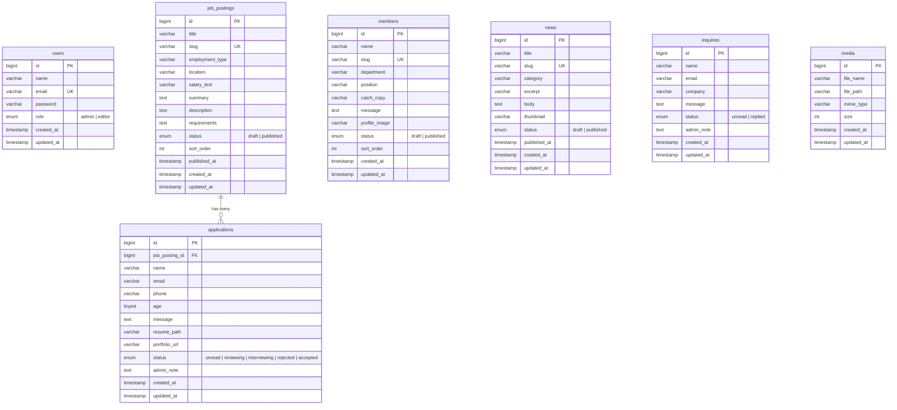

# ER 図

```mermaid
erDiagram
    users {
        bigint id PK
        varchar name
        varchar email UK
        varchar password
        enum role "admin | editor"
        timestamp created_at
        timestamp updated_at
    }

    job_postings {
        bigint id PK
        varchar title
        varchar slug UK
        varchar employment_type
        varchar location
        varchar salary_text
        text summary
        text description
        text requirements
        enum status "draft | published"
        int sort_order
        timestamp published_at
        timestamp created_at
        timestamp updated_at
    }

    applications {
        bigint id PK
        bigint job_posting_id FK
        varchar name
        varchar email
        varchar phone
        tinyint age
        text message
        varchar resume_path
        varchar portfolio_url
        enum status "unread | reviewing | interviewing | rejected | accepted"
        text admin_note
        timestamp created_at
        timestamp updated_at
    }

    members {
        bigint id PK
        varchar name
        varchar slug UK
        varchar department
        varchar position
        varchar catch_copy
        text message
        varchar profile_image
        enum status "draft | published"
        int sort_order
        timestamp created_at
        timestamp updated_at
    }

    news {
        bigint id PK
        varchar title
        varchar slug UK
        varchar category
        varchar excerpt
        text body
        varchar thumbnail
        enum status "draft | published"
        timestamp published_at
        timestamp created_at
        timestamp updated_at
    }

    inquiries {
        bigint id PK
        varchar name
        varchar email
        varchar company
        text message
        enum status "unread | replied"
        text admin_note
        timestamp created_at
        timestamp updated_at
    }

    media {
        bigint id PK
        varchar file_name
        varchar file_path
        varchar mime_type
        int size
        timestamp created_at
        timestamp updated_at
    }

    job_postings ||--o{ applications : "has many"
```
